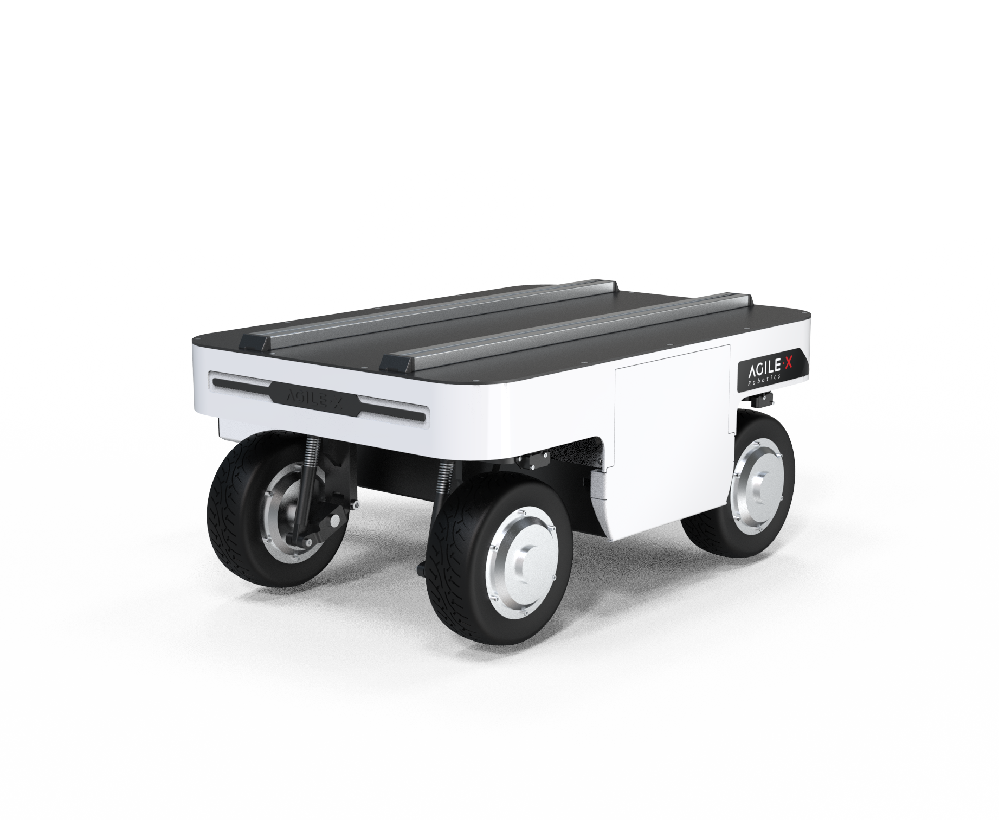

# mc_embodied_kit_ros
MC Embodied Intelligence Suit ROS Package

## Packages

* ranger_base: a ROS wrapper around ranger SDK to monitor and control the robot
* ranger_bringup: launch and configuration files to start ROS nodes
* ranger_msgs: ranger related message definitions

## Communication interface setup

Please refer to the [README](./ugv_sdk/README.md) of "ugv_sdk" package for setup of communication interfaces.

## Note on CAN interface on Nvidia Jetson Platforms

Nvidia Jeston TX2/Xavier/XavierNX/Orin Nano have CAN controller(s) integrated in the main SOC. If you're using a dev kit, you need to add a CAN transceiver for proper CAN communication. 

## Supported hardware

Ranger Mini V3.0



## Basic usage of the ROS package

1. Install dependent packages

    ```
    $ sudo apt-get update
    $ sudo apt-get install build-essential git cmake libasio-dev libpcap-dev libboost-all-dev
    $ sudo apt install ros-noetic-joint-state-publisher-gui -y
    $ sudo apt install ros-noetic-ros-controllers -y
    $ sudo apt install ros-noetic-gmapping -y
    $ sudo apt install ros-noetic-map-server -y
    $ sudo apt install ros-noetic-navigation -y
    ```
    
2. Clone the packages into your catkin workspace and compile

    (the following instructions assume your catkin workspace is at: ~/catkin_ws/src)

    ```
    $ cd ~/catkin_ws/src
    $ git clone -b ranger_mini3.0 https://github.com/elephantrobotics/mc_embodied_kit_ros.git
    $ cd ..
    $ catkin_make
    ```

3. Setup CAN-To-USB adapter
* Enable gs_usb kernel module(If you have already added this module, you do not need to add it)
    ```
    $ sudo modprobe gs_usb
    ```
* first time use ranger-ros package
    ```
    $rosrun ranger_bringup setup_can2usb.bash
    ```
* If not the first time use ranger-ros package(Run this command every time you turn on the power)
    ```
    $rosrun ranger_bringup bringup_can2usb.bash
    ```
* Testing command

    ```
    # receiving data from can0
    candump can0
    ```

4. Launch ROS nodes

* Start the base node for the real robot whith can

    ```
    $ roslaunch ranger_bringup ranger_mini_v2.launch
    ```
* Start the keyboard tele-op node

    ```
    $ roslaunch ranger_bringup teleop_keyboard.launch
    ```

* If the can-to-usb has been connected to the ranger robot and the car has been turned on, use the following command to monitor the data from the ranger chassis

    ```
    candump can0
    ```

## Ranger mini V3.0 chassis navigation implementation

>>**Note:** Before use, make sure that the required equipment is connected correctly and CAN communication is normal.

### Radar Mapping - Gmapping

1. **Enable chassis node and radar communication**

    ```
    roslaunch ranger_odometry ranger_active.launch
    ```

    **Note:** Before starting the chassis node, make sure the CAN bus is enabled. When the system is restarted or the CAN bus is replugged, the enable command needs to be executed: `rosrun ranger_bringup setup_can2usb.bash`

2. **Open gmapping - map launch file**

    ```
    roslaunch ranger_navigation mapping.launch
    ```

3. **Enable the car remote control function**

    Please refer to the [Car Remote Control Instructions](https://agilexsupport.yuque.com/staff-hso6mo/rg519a/fqfo0alugiglumyw?singleDoc#3bc79ae4) section to control the movement of the car.

4. **Start building the map**

    Now the chassis car can move under the remote control of the handle. At the same time, you can observe in the Rviz space that as the car moves, our map is gradually built.

    Note: In order to obtain better mapping effects, it is recommended to push the joystick slowly and drive at a low speed when operating the handle remote control, because lower speeds tend to produce better mapping effects.

5. **Save the constructed map**

    Open another new terminal console and enter the following command in the command line to save the map scanned by ranger:

    ```
    cd ~/catkin_ws/src/mc_mebodied_kit_ros/ranger_navigation/map

    rosrun map_server map_saver
    ```
    After successful execution, two default map parameter files, map.pgm and map.yaml, will be generated in the current path (`~/catkin_ws/src/mc_mebodied_kit_ros/ranger_navigation/map`).

### Map Navigation

Before this, we have successfully created a spatial map and obtained a set of map files, namely map.pgm and map.yaml in the `~/catkin_ws/src/mc_mebodied_kit_ros/ranger_navigation/map` directory.

1. **Open chassis node and radar communication**

    ```
    roslaunch ranger_odometry ranger_active.launch
    ```

2. **Run navigation launch file**

    ```
    roslaunch ranger_navigation navigation_active.launch
    ```

**SAFETY PRECAUSION**: 

Always have your remote controller ready to take over the control whenever necessary. 
